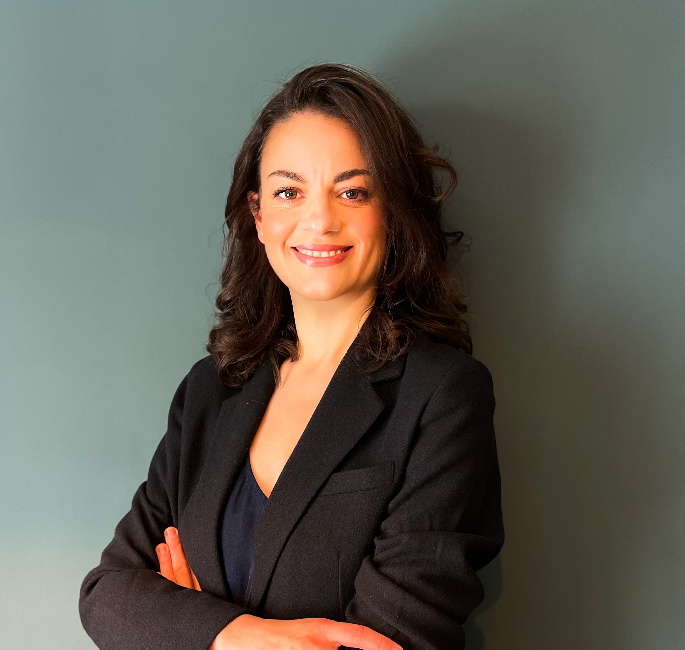

# About King's Neuro Consultants

King’s Neuro Consultants brings together specialist neurological care and advanced neuroscience expertise. Our approach combines clinical excellence and scientific rigour to provide:

-   **Patients with clear, evidence-based neurological care**\
-   **Research and industry partners with strategic scientific insight**\

Clinical services and research consultancy operate as distinct professional activities within the organisation

------------------------------------------------------------------------

## Meet the Team

:::: about-container
::: about-profile

### Dr. Hatice King \| Consultant Neurologist

**Specialist Private Neurology – Cork**

Dr. Hatice King is a highly accomplished **Consultant Neurologist** who graduated with distinction from Istanbul University, Turkey. After completing her specialist neurology training in 2018, she was awarded a prestigious research fellowship by the **European Academy of Neurology**.

With a background in advanced research at the **University of Edinburgh**, **senior clinical roles** in major UK-wide **Motor Neuron Disease** (MND) and **Multiple Sclerosis** (MS) clinical trials and extensive experience working within the **UK's National Health Service** (NHS), Dr. King brings world-class academic expertise to private clinical practice.

She is a member of the European Academy of Neurology, the Irish Institute of Clinical Neuroscience and the Royal College of Physicians of Ireland.

**Specialist Clinical Expertise**

-   **Headache & Migraine:** Specialist management of headache syndromes and modern treatment options.
-   **Multiple Sclerosis (MS):** Comprehensive care and the latest disease-modifying strategies.
-   **Epilepsy & Seizure Management:** Expert diagnostic review and long-term management.
-   **Stroke & TIA:** Timely outpatient management of underlying risk factors and secondary prevention strategies.
-   **Functional Neurological Disorder (FND):** Compassionate, specialist-led diagnostic pathways.
-   **General Neurology:** Expert assessment and management of common neurological conditions, as well as neurodegenerative disorders including Parkinson's disease, Alzheimer's disease and other dementia syndromes.
:::
::::

<!-- Separator / banner -->

::: profile-separator
**Research & Consultancy**
:::

:::: about-container
::: about-profile

### Dr. Declan King \| Director

**Neuroscience Researcher & Strategic Consultant**

**Translational Expertise in Synaptic Biomarkers, Neurodegeneration & Brain Ageing**

Dr. Declan King brings over 20 years of research leadership from the **University of Edinburgh**. He specializes in synaptic resilience, molecular pathology and brain ageing.

His career includes high-impact collaborations with **global pharmaceutical leaders**, the National Institutes of Health (**NIH)**, and the **FNIH** (Foundation for the NIH). He focuses on **applying biomarker science to inform research strategy and early-stage development decisions**.

**Core Expertise & Impact:**

-   **Translational Biomarker Innovation:** Played a pivotal role in establishing **SV2A PET imaging** as a validated biomarker for synaptic density, a breakthrough that directly supports target engagement and patient stratification in neurodegenerative and ageing-focused studies.\

-   **Synaptic Resilience & Brain Ageing:** Extensive experience investigating the molecular architecture of the "resilient brain," providing evidence-based insights into how synaptic composition protects against cognitive decline in ageing and neurodegeneration.\

-   **Multimodal Research Leadership:** Author of over 25 peer-reviewed publications spanning post-mortem human tissue, animal models and advanced molecular imaging to bridge the gap between basic research and translational application.

**Consultancy Service**

Dr. Declan King advises pharmaceutical, biotech, academic and longevity-focused ventures on:

-   **Translational strategy and biomarker integration** \
-   **Scientific insight into synaptic resilience and brain ageing**\
-   **Evidence-based research guidance for early-stage projects**\

:::
::::

------------------------------------------------------------------------

**Working Together**

**King’s Neuro Consultants brings together:**

-   **Specialist private neurological care :** Dr. Hatice King.\

-   **Strategic neuroscience research consultancy :** Dr. Declan King.\

These services operate independently but reflect a shared commitment to evidence-based neurological science.

*Medical advice, diagnosis, and treatment are provided solely by a qualified medical professional.*
